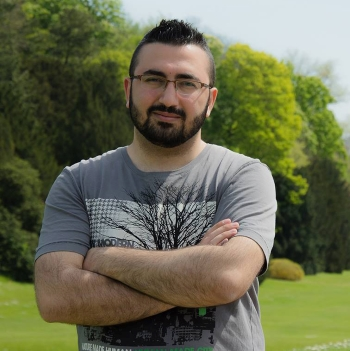

# Introduction

i'm John and I from Syria - Aleppo . I move to Brussels since 6 years.

## My interests

I am generally interested in technology, finance, crypto, and the stock market.

so I am learning Front-End Web Development at HackYourFuture so i can mix my
experiences to start my own fintech company or to find a job in a fintech
company.

## My Goal list after finish HYF is to learn

1. python
2. php
3. sql
4. AI

### my hobbies

- reading
- Technology
- plants care & aquascaping
- swimming

here is a photo of me in Brussels last summer: :metal:

> **P.S**: you can find the google map location by clicking
> [here](https://goo.gl/maps/HJqTEgcB6vERrHkz8).

### Languages I speak

| **language** | **level** |
| :----------: | :-------: |
|    Arabic    |    5/5    |
|   English    |    4/5    |
|    French    |    3/5    |
| Netherlands  |    1/5    |
